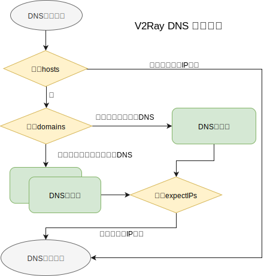

# DNS服务

V2Ray 内置的 DNS 服务，其解析的IP往往先是用来匹配路由规则，如果配置不当，请求会在DNS请求上耗费一定时间。

路由routing的`"domainStrategy"`的几种模式都跟DNS功能密切相关，所以在此专门说一下。

* `"AsIs"`，当终端请求一个域名时，进行路由里面的domain进行匹配，不管是否能匹配，直接按路由规则走。
* `"IPIfNonMatch"`, 当终端请求一个域名时，进行路由里面的domain进行匹配，若无法匹配到结果，则对这个域名进行DNS查询，用结果的IP地址再重新进行IP路由匹配。
* `"IPOnDemand"`, 只要路由规则里面存在IP路由匹配，所有请求的域名都先进行DNS解析，用IP地址进行IP路由匹配。

可见，`AsIs`是最快的，但是分路由的结果最不精确；而`IPOnDemand`是最精确的，但是速度是最慢的。

## DNS流程



## 基础配置
```json
{
 "dns": {
   "servers": [
     "1.1.1.1",
     "localhost"
   ]
 }
}
```

DNS模块的基础使用并没有什么特别复杂的地方，就是指定一个或几个DNS服务器，v2ray会依次使用（查询失败时候会查询下一个）。其中"localhost"的意义是特殊的，作用是本地程序用系统的DNS去发请求，而不是V2ray直接跟DNS服务器通信，这个通信不收Routing等模块的控制。

## 进阶配置

虽然这是基本篇，但是不想在高级那边再开一篇DNS了，就写这。

### 客户端分流配置

```json
{
 "dns": {
   "servers": [
     {
       "address": "119.29.29.29",
       "port": 53,
       "domains": [
         "geosite:cn"
       ],
       "expectIPs": [
         "geoip:cn"
       ]
     },
     {
       "address": "8.8.8.8",
       "port": 53,
       "domains": [
         "geosite:geolocation-!cn",
         "geosite:speedtest",
         "ext:h2y.dat:gfw"
       ]
     },
     "1.1.1.1",
     "localhost"
   ]
 }
}
```

DNS服务是可以用来分流的，大致思路是，”哪些域名要去哪个DNS服务器解析，并希望得到属于那里的IP地址“。
配置的规则跟路由模式中用的是相似的，详细使用还需参考官方文档。

上面的配置思路这里解释一下：国内域名匹配到domains里面，使用119.29.29.29进行查询，并期待得到国内的IP地址；如果得到的地址并不是国内的，则进行下一个DNS服务器进行查询，并使用新的结果。不是国内的域名会匹配到第二个配置， 使用8.8.8.8进行查询，这次不需要期待特别的IP了，可直接使用返回的；如果以上过程都有问题，则直接查询1.1.1.1，再不行让本地DNS试试吧。


### 服务器配置

```json
{
 "dns": {
   "servers": [
     "DOHL_1.1.1.1",
     "localhost"
   ]
 }
}
```

服务端的DNS一般无需复杂配置。如果配置了，应注意`freedom`的outbound应配置了`"domainStrategy"`为`"UseIP" | "UseIPv4" | "UseIPv6"`几种的时候才会使用内置DNS，默认的`AsIs`是交给操作系统去解析和连接。

新版本4.22.0+后加入的DOH功能，部署在服务器端时候可以简单使用。

## DNS over HTTPS

V2Ray 4.22.0 新加入的功能，也没特殊配置的地方，就是上述配置里面的DNS地址前面加上`DOH_`或`DOHL_`几个字符。一般只在服务端使用`DOHL`模式，而墙内目前似乎没有稳定的DOH提供商，只有`1.1.1.1`一家可用，而且效果并不稳定。

```json
{
 "dns": {
   "servers": [
     "DOH_1.1.1.1",
     "localhost"
   ]
 }
}
```

DOH服务商不像传统DNS那么成熟，目前网上提供DOH的服务商可以参考[curl - DNS over HTTPS](https://github.com/curl/curl/wiki/DNS-over-HTTPS)

列表中的服务地址都是写成`https://cloudflare-dns.com/dns-query`的样子，在V2Ray 配置中应该只取其域名，写成`"DOH_cloudflare-dns.com"`，或者`"DOH_1.1.1.1"`。注意，多数服务商的DOH的tls证书是没有对IP地址签发认证的，必须写实际的域名，cf的1.1.1.1是个特殊例外。

DOH把DNS请求融入到常见的https流量当中，完全使用DOH可以避免出入口ISP知道你访问的域名。
但需要注意，只有在客户端、服务端都使用DOH协议(客户端使用DOH模式，服务端使用DOHL模式)时候，VPS出口上才不会出现传统的UDP DNS请求。

DOH的解析时间比传统的UDP要高不少，把V2Ray的log level设置为debug可以看到具体的域名解析耗时值。

```
2019/11/28 17:34:55 [Info] v2ray.com/core/app/dns: UDP:1.1.1.1:53 got answere: www.msn.com. TypeA -> [204.79.197.203] 8.9953ms
...
2019/11/28 17:42:50 [Info] v2ray.com/core/app/dns: DOH:1.1.1.1:443 got answere: lp-push-server-849.lastpass.com. TypeA -> [192.241.186.205] 182.1171ms
```

以下列出解析耗时参考值：

* 美国VPS UDP 1.1.1.1：1ms~5ms
* 美国VPS DOHL 1.1.1.1：10ms~100ms
* V2Ray客户端 国内UDP 1.1.1.1：200ms~1s
* V2Ray客户端 国内DOH 1.1.1.1：200ms~3s

但是实际中因为网络原因之类问题，也可能出现DOH耗时比UDP还小的。个人感觉这个耗时虽然有区别，但都是较小的间隙，实际使用很少有察觉。

大家按需选择使用即可。

------
#### 更新历史

- 2019-11-28 初版。
- 2019-11-29 增加描述。
